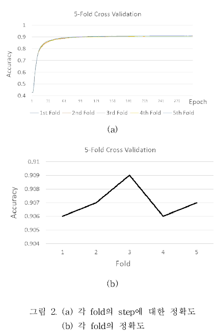

# Gait-Classification with SmartShoes
머신러닝을 이용한 이상보행 검출
Detection Of Abnormal Walking Using Machine Learning

# Gait-Classification
Gait-Classification Process by SmartShoes Data
This study suggests a machine learning algorithm
for smart shoes sensor data to detect an abnormal
walk. Random forest based on decision tree is
designed for the sensor data, which is fast and
noise-resistant. The accuracy to discriminate the
abnormal data from normal one was about 90.7%
using the suggest random forest model

#Result

